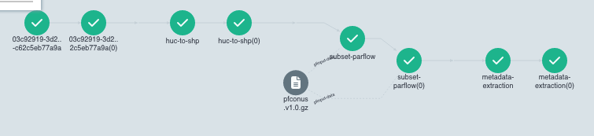
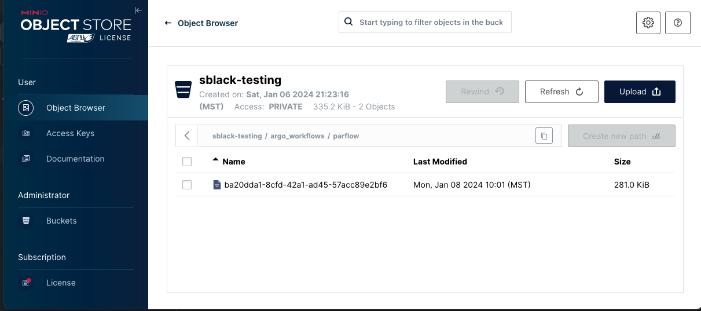

# Argo Workflows for Subsetting


Argo Workflows are containerized DAG workflows declared in yaml that run on Kubernetes.  Each node in the workflow is a docker container with S3 storage.

*An example graph of the parflow subsetter workflow*


The `templates/` directory contains workflows which declare composable [templates](https://argo-workflows.readthedocs.io/en/latest/workflow-templates/).  They are referenced by the workflows in the `workflows/` directory with a [templateRef](https://argo-workflows.readthedocs.io/en/latest/workflow-templates/#referencing-other-workflowtemplates)

Artifact storage is S3 w/MinIO.  We use artifacts to store input and output files for our workflows.  Each user is given a bucket (TODO: configurable Version Control and Quotas) for storing output data of their workflows.  The output of one workflow may be used as input to subsequent workflow runs.

The 3 supported subsetter workflows (nwm1, nwm2, parflow) write the result to S3 storage in their own bucket at `/argo_workflows/{workflow_template}/{GUID}`.  A GUID is generated for each run of a subsetter workflow and is used as the workflow run name.  An example parflow subsetter output viewed in the MinIO viewer is shown below.


The subsetter input datasets are stored on the [CUAHSI MinIO instance](https://console.minio.cuahsi.io).  This bucket has public read access.  The workflows use these datasets as input artifacts within a subsetter workflow.  A workflow conveninently maps an artifact to a path within a container that can be used as input our output locations to a program running in the container.

*Example output declaration with configurable output locations.  [ArtifactRepositoryRef](https://argo-workflows.readthedocs.io/en/latest/artifact-repository-ref/) could be used to simplify artifact use.*

```yaml
outputs:
        artifacts:
          - name: subsetter-result
            path: /output
            s3:
              endpoint: api.minio.cuahsi.io
              bucket: '{{inputs.parameters.output-bucket}}'
              accessKeySecret:
                name: minio-credentials
                key: accessKey
              secretKeySecret:
                name: minio-credentials
                key: secretKey
              key: '{{inputs.parameters.output-path}}'
```

# `minio-credentials` access key/secret setup;
1. Create an access key/secret in the minio UI at 
2. Save the key/secret as a secret in kubernetes in the `workflows` namespace
`kubectl create secret generic minio-credentials --namespace workflows --from-literal=accessKey='<key>' --from-literal=secretKey='<secret>`

These workflows should eventually be setup to automatically sync to https://workflows.argo.cuahsi.io