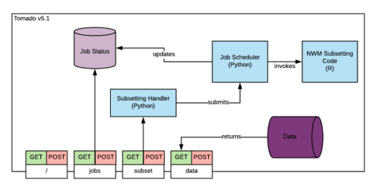
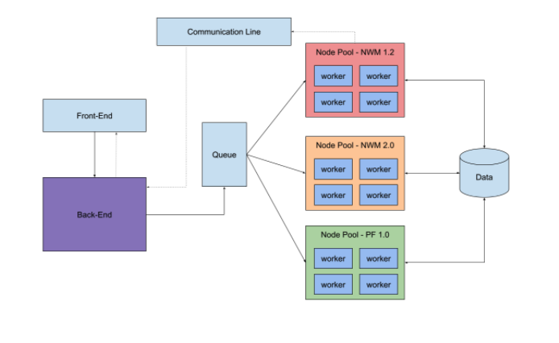
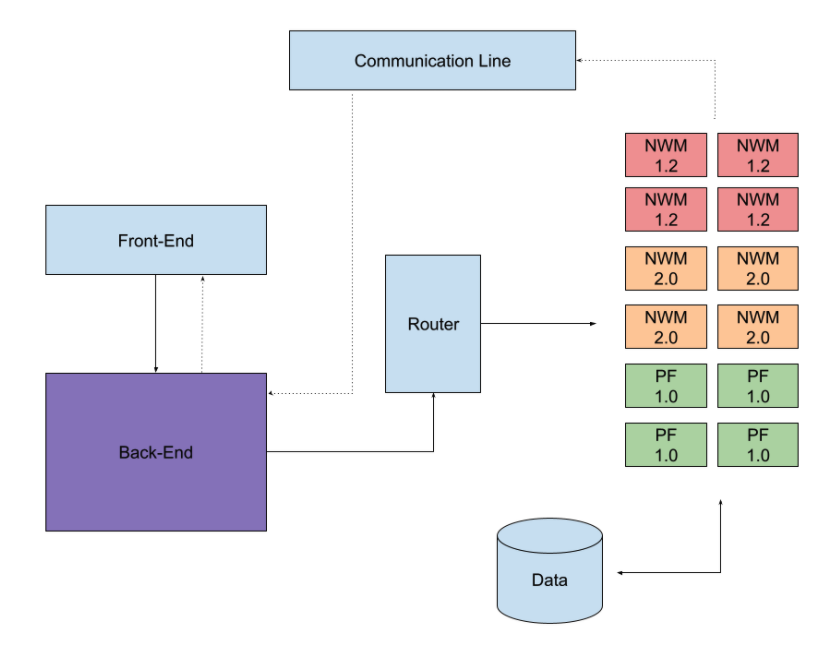
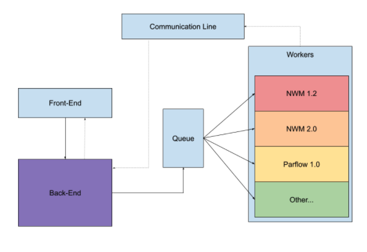

# Model Domain Subsetter

**Version**: 2.0  
**Author:** Tony Castronova  

## Contents

1. [Project Overview](#1.-project-overview)  
1.1 [Executive Summary](#1.1-executive-summary)  
1.2 [Goals](#1.2-goals)  
1.3 [Non-Goals](#1.3-non-goals)  
1.4 [System Architecture](#1.4-system-architecture)
2. [Existing Features](#2.-existing-features)  
2.1 [Map](#2.1-map)  
2.2 [API](#2.2-api)  
2.3 [Help](#2.3-help)  
3. [Design Considerations](#3.3.-design-considerations)  
3.1 [Vanilla](#3.1-vanilla)  
3.2 [Native Kubernetes](#3.2-native-kubernetes)  
3.3 [Kubernetes Microservices](#3.3-kubernetes-microservices)  
3.4 [Firebase](#3.4-firebase)  
4. [Proposed Design](#4.-proposed-design)  
4.1 [Features](#4.1-features)  
4.2 [Constraints](#4.2-constraints)  
4.4 [Technical Approach](#4.4-technical-details)  
4.4.1 [Front-End](#4.4.1-front-end)  
4.4.2 [Back-End](#4.4.2-back-end)  
4.4.3 [Communication Line](#4.4.3-communication-line)  
4.4.4 [Queue](#4.4.4-queue)  
4.4.5 [Workers](#4.4.5-workers)  

## 1. Project Overview

## 1.1 Executive Summary

Large scale surface water and groundwater models are an essential tool for improving our understanding of the dynamic interaction between the water cycle and human activity. This is especially true when investigating human impacts, extreme hydrologic events, and future water resource availability. Results from these models advance hydrologic science and inform neighboring research disciplines—for example drought and flooding forecasts influence research in biology, sociology, and economics. As a result, community intellectual contributions to the physics, configuration, and validation of continental-scale models is essential to improving the usefulness and adoption of these models within the academic community. Due to the computational-scale of these models, they often require specialized computing hardware and vast amounts of domain and forcing data, making it difficult for the broader water science community to directly engage in development efforts. The Consortium of Universities for the Advancement of Hydrologic Science, Inc and the National Center for Atmospheric Research have recognized this challenge and are collaborating to improve the accessibility of model domain data to lower the barrier of entry for using and applying these models and engage a wide variety scientists and a diverse spectrum of expertise. 

The purpose of this application is to introduce a collaborative effort for preparing, publishing, and sharing subsets of the National Water Model input data at watershed scales. With a combination of modern cyberinfrastructure techniques and state-of-the-science modeling tools, researchers will have access to subsets of National Water Model information that would otherwise require extensive computational resources. This work will provide the foundation onto which similar efforts can be applied to other large-scale model simulations and input data.

The current architecture implements  a producer-consumer pattern, where some work is produced by a producer and completed by some consumer. More concretely, in our case, it consists of a front-end web interface that receives job requests, produces some work,and passes that work  to a pool of consumers (workers). The code, data, and dependencies required to execute  jobs are pre-installed on the system; as such, workers run code existing on the system parameterized by job requirements. Once a job is complete, the resulting payload is downloaded via the front-end web-ui. 

There are several disadvantages to the current implementation, specifically:

- A growth in job types increases the number of dependencies installed on the system. This increases the likelihood of dependency versioning issues.

- Large VMs are necessary to support the wide-range of job requirements, e.g. computational requirements such as RAM, CPU, etc. This will become cost prohibitive as the service expands in the future.

- Adding new jobs requires modifying the front-end UI.

- The architecture is highly coupled and difficult to test locally, any addition of job types magnifies this issue.

### 1.2 Goals

- Provide a web interface for obtaining the static model files and parameters necessary to execute hydrologic models that have been developed at the CONUS scale, at local and regional scales. 

- Provide guidance to the CUAHSI community regarding the configuration and execution of all supported hydrologic models.

- Support subsetting functionality for multiple hydrologic models and multiple model versions.

- Allow new subsetting algorithms to be included with minimal modification to the core subsetting service and minimal downtime.

### 1.3 Non-Goals

- This services is limited to catchment scale hydrologic modeling applications. We have not fully evaluated the performance of this service and therefore have arbitrarily decide that this version of the application should only be applied at local and regional scales.

- This version of the software will reuse as much existing code as possible. As a result, it will leverage multiple programming languages, wrapped in Python 3.6. Future versions will migrate R code to Python as necessary.

- The current version of the software will perform naive bounding box subsetting, which will not use stream tracing and therefore may not capture the entire upstream catchment in the subsetted domain. 

    **NWM Specific**  

- Model nudging files will not be included in the subsets.

- Due to the limited availability of NWM restart files this service will not provide access to them. 

### 1.4 System Architecture

In general, it consists of a (1) front-end web interface, (2)  
a back-end web server and API, (3) a job scheduler, and (4) and pool of workers that perform subsetting jobs. This section provides a high-level overview of  each of these system components.

Figure 1: Overview of System Architecture.

#### 1.4.1 Front-end

The front-end website is built on the Tornado framework, the map interface is written in Javascript and uses the Leaflet software package. All website documentation is written in Markdown and is “compiled” into html using a utility script and rendered using Jinja templates.

The front-end component is provides an interface for interacting with and submitting subsetting jobs. This largely consists of documentation and an interactive map for selecting spatial extents using predefined hydrologic boundaries (i.e. NHD HUC boundaries). Selections on the map are communicated to the back-end server through a standard application programming interface (API).

**Map Interface**

Figure 2: Map Interface.

The map interface is rendered using Leaflet and provides an interactive means for users to select domain extent. There exist several additional features to assist in this process including manually adding boundaries via HUC code as well as wildcard completion that allows users to select all HUC-12 boundaries with larger areas (e.g. 10013209\*).

While the map interface requires domain boundaries to be specified via HUC-12's, the interface provides additional watershed boundaries to assist in the identification and selection process.  Additionally, USGS gage locations are included in the map interface so users can identify reach outlets.

Because a full software performance evaluation has not been performed, users are currently limited to area of moderate size. This threshold was chosen arbitrarily and, if exceeded, the *Submit* button will become deactivated.

**Implementation Notes**

- The front-end website uses the Tornado v5.1 framework.

- Map interface is written in Javascript and uses the leaflet software package.

- Documentation is written in Markdown and transpiled  into html and rendered in Jinja templates.

**Model Specific Notes**

For the NWM (v1.2 and v2.0), the map interface passes the bounding box encapsulating the select region as input to the subsetting algorithm. This means that user must only select watershed boundaries until the bounding box spans their entire area of interest.

For Parflow (PF-CONUS v1.0), data is not available for the entire CONUS. This is indicated using a gray mask that overlays the map interface, however this does not prevent users from selecting watershed boundaries outside of the supported region. The map interface passes a list of HUC ids to the backend server as input to the Parflow subsetting algorithm.

**Job Status**

TODO

**Data Download**

TODO

#### 1.4.2 Back-end

The back-end server is embedded in the Tornado website described above. The back-end server contains all website and API endpoints. This includes pages such as the map interface and documentation, as well as endpoints for submitting jobs, tracking job progress, and obtaining completed results.

Jobs are executed asynchronously using the Python Multiprocessing library and a “worker-manager” paradigm. All jobs are executed on the same system as the front-end website.

**Implementation Notes**

- The back-end component is embedded in the Tornado website described above.

- Jobs are executed asynchronously using the Python Multiprocessing library and a “worker-manager” paradigm. All jobs are executed on the same system as the front-end website.

- Job progress is tracked by passing log messages through a REDIS database.

#### 1.4.3 Job Scheduler

Jobs are stored in a Python Multiprocessing Queue in the back-end component. This queue is made available to the Multiprocessing worker pool 

#### 1.4.4 Worker Pool

Workers are currently implemented as a Python multiprocessing pool on the same server as the front-end and back-end system components. All job dependencies are installed in the same Anaconda environment which poses challenges when supporting a larger range of jobs.

**Implementation Notes**

- Workers are currently implemented as a Python multiprocessing pool on the same server as the front-end. 

- All job dependencies are installed in the same Anaconda environment which poses challenges when supporting a larger range of jobs.

- Jobs are stored in a Python Multiprocessing Queue in the back-end component.

- Job progress is shared through a REDIS database

#### 1.4.5 Communication Line

The purpose of the communication line is to facilitate messages between the workers and the back-end component. This includes, but is not limited to, progress updates, error codes, and task results. The communication line exists between the back-end component and the worker pool primarily to collect job progress updates. These messages are passed to the front-end user interface to provide progress updates.

**Implementation Notes**

- Job status is made accessible through a REST API method.

- Job status updates are passed through a REDIS database and consumed by the back-end component.

- The back-end component pushes messages to the front-end user interface using web sockets.

## 2. Existing Features

### 2.1 Map

- Customized maps based on hydrologic model and model version (e.g. NWM v1.2, NWM v2.0, Parflow v1.0).

- Watershed boundary layers: HUC 2, 4, 10, 12.

- One selectable/de-selectable layer, HUC 12.

- Ability to manually watershed boundaries using HUC codes. This also supports wildcard notation to select all HUC's within a parent boundary.

- USGS gage locations and popup metadata that includes ID and Name.

- Map selection clearing.

### 2.2 API

- Endpoint for subsetting NWM v1.2.2, minimal documentation.

- Endpoint for obtaining job status, minimal documentation.

- Endpoint for downloading results, minimal documentation.

### 2.3 Help

- Minimal documentation for using the NWM and Parflow models.

## 3 Design Considerations

### 3.1 Vanilla

In this option we focus primarily on satisfying project goal #1, migrate the existing system to GCP. We will make minimal changes to the existing system to accomplish this. In this option, the front-end/back-end/worker-pool will be containerized and connected to a containerized REDIS database using docker-compose. Domain data will be stored on the VM running the front-end/back-end/worker-pool.

#### 3.1.1 Pros

- Quickly deploy the Subsetting service to GCP.

#### 3.1.2 Cons

- Does not satisfy goal #4: Allow new subsetting algorithms to be included with minimal modification to the core subsetting service and minimal downtime.

- Does not minimize hosting costs.

### 3.2 Native Kubernetes

In this option we modify the existing worker pool such that each job is represented as a Kubernetes Node Pool. This allows us to have multiple workers waiting for job requests to operate on. Domain data will be stored in a central location that can be mounted into the running jobs in their respective node pools. A queue service is used to hold the list of jobs to be executed. Workers listen to this queue and execute jobs that match their specific label/queue name.

#### 3.2.1 Pros

- Workers are containerized which resolves the dependency management problem.

- Workers execute jobs on VMs separate from the front-end/back-end components.

- New subsetting algorithms can be included by adding new node pools.

- Node pools can scale horizontally and vertically to meet the job demand.

#### 3.2.2 Cons

- This will take longer to deploy on GCP than the “Vanilla” option.

- Reduces cloud hosting cost, however the Kubernetes overhead cost and cost of running node pools is not negligible.

- Does not satisfy goal #4: Allow new subsetting algorithms to be included with minimal modification to the core subsetting service and minimal downtime.

- Does not minimize hosting costs.

### 3.3 Kubernetes Microservices

In this option we modify the existing worker pool such that each job is represented as a Function-as-a-Service (FaaS). This approach will still use Kubernetes as the orchestration layer, but will leverage one of the FaaS frameworks. This still allows us to have multiple workers waiting for job requests, however these workers are not running when inactive. Instead, the FaaS framework will start and stop worker VMs as needed, that is workers will run like lambda functions.

#### 3.3.1 Pros

- Workers are containerized which resolves the dependency management problem.

- Workers execute jobs on VMs separate from the front-end/back-end components.

- New subsetting algorithms can be included by adding new FaaS functions

- Minimizes Kubernetes overhead cost and cost of running worker functions.

- FaaS functions can scale horizontally and vertically to meet the job demand.

- In an ideal world, production is reproducible at various hardware scales. Introduces the ability for a researcher/agency to run the system locally if that best fits their needs.

#### 3.3.2 Cons

- New approach that will take longer for us to implement.

### 3.4 Firebase

In this option we leverage google’s firebase framework and tools to accomplish the goals of 3.3, however couple the design to a framework (this may be undesirable). This approach would use firebase’s hosting to host the frontend and backend services and migrate subsetting jobs to google cloud functions. Transient data, such as subset output, would be stored in google cloud buckets which work nicely with firebase. One major advantage of this proposed solution in firebase’s analytics toolchain. This would allow us to better understand who, how, and how often this service is used.

#### 3.4.1 Pros

- Workers are containerized which resolves the dependency management problem.

- Workers execute jobs as cloud functions separate from the front-end/back-end components.

- All in one solution. It is easy to add firebase solutions to our existing deployments (i.e. analytics).

- New subsetting algorithms can be included by adding new cloud functions.

- This should be faster than 3.3 in two ways: 

    - Going from development to deployment. There are a plethora of adaptable examples.
    
    - Google has optimized their cloud functions, I would expect runtime to be faster in this solution than 3.3.

#### 3.4.2 Cons

- Difficult to reproduce production/development environment locally.

- Migration to other cloud providers becomes much harder. Code will be coupled to firebase SDK meaning there may be future technical debt.

## 4. Proposed Design

In late 2021, this service was migrated from CUAHSI-hosted servers to the commercial cloud (i.e. GCP). During this process, the service was "dockerized" for ease of deployment however few other changes were made. To minimize cloud hosting cost, the service is currently hosted on a moderate sized VM. However, this is not a cost efficient nor scalable solution. **The primary goal of the proposed work is to modify the underlying software architecture to make this service more cost effective and resilient moving forward**. In doing so we will update web frameworks and libraries as necessary and include additional UX-focused features. 

## 4.1 Features

### 4.1.1 Software Architecture

- De-coupled front and back-end components.

- Containerized subsetting jobs.

- Horizontal scaling to support an arbitrary number of job submissions.

- Documentation for including additional subsetting jobs as containerized objects.

- Usage logging and archival using Prometheus (or similar technology)

### 4.1.2 Map

- NHD reach vectors and metadata (ID, Name).

- Upstream reach and watershed boundary tracing.

## 4.2 Constraints

- This service is currently being used by the community and is a critical part of the NSF HydroFrame project. As such, upgrades to the system cannot cause prolonged downtime.

## 4.3 Technical Approach

Figure 3: Proposed System Architecture

### 4.3.1 Front-End

- Nginx load balancer?

- React + Typescript front-end that implements all v0.1 features.

### 4.3.2 Back-End

- FastAPI server or Flask

### 4.3.3 Communication Line

TODO

### 4.3.4 Queue

TODO

### 4.3.5 Workers

- Google Cloud Functions

### 4.3.6 Data Storage

- Results are stored in...

- Raw domain data is stored in... 

